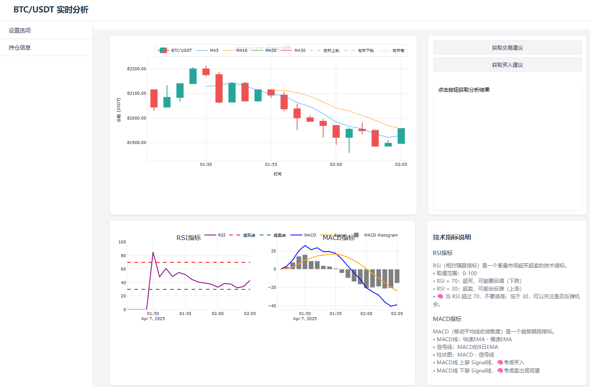

# BTC-DeepSeek 比特币实时分析系统



这是一个基于 DeepSeek API 的比特币实时分析系统，集成了K线图表、技术指标分析和AI交易建议功能。系统实时监控BTC/USDT交易对，提供专业的技术分析和AI驱动的交易建议。

## 主要功能

- 实时K线图表显示
- 多重移动平均线指标 (MA5, MA10, MA20, MA30)
- RSI和MACD技术指标分析
- AI驱动的交易建议
- 实时价格监控和提醒

## 功能特点

- 实时K线图表显示
- 多种技术指标（MA、RSI、MACD、布林带）
- 实时价格更新
- deepseekai交易建议分析
- 持仓输入，可接入ai分析
- 安全的访问控制，白名单，ip访问限制

## 系统要求

- Python 3.8 或更高版本
- 稳定的网络连接
- 现代浏览器（Chrome、Firefox、Safari等）

## 安装步骤

1. 克隆项目到本地：


2. 安装依赖：
```bash
pip install -r requirements.txt
```

3. 配置访问密码和deepseekkey：
编辑 `auth_config.py` 文件，设置您的访问密码：
```python
ACCESS_TOKEN = "您的访问密码"
设置您的deepseek key
```

## 运行应用

1. 启动应用：
```bash
python btc_kline_collector.py
```

2. 访问应用：
打开浏览器，访问 `http://localhost:8050`

## 使用说明

1. 登录系统：
   - 输入配置的访问密码 默认为mogu11223344
   - 点击登录按钮

2. 查看图表：
   - K线图显示实时价格走势
   - 技术指标图显示RSI和MACD指标

3. 获取分析：
   - 点击"获取交易建议"获取持仓分析
   - 点击"获取买入建议"获取买入建议

4. 设置选项：
   - 可选择不同的K线周期
   - 可选择显示/隐藏不同的技术指标

## 安全说明

- 系统使用访问密码保护
- 支持IP白名单限制
- 登录尝试次数限制
- 所有API请求使用HTTPS

## 注意事项

- 请确保网络连接稳定
- 建议使用现代浏览器访问
- 首次启动可能需要等待数据收集
- 分析结果仅供参考，请谨慎交易

## 技术支持

如有问题或建议，请提交 Issue 或联系技术支持。

## 许可证

MIT License 
